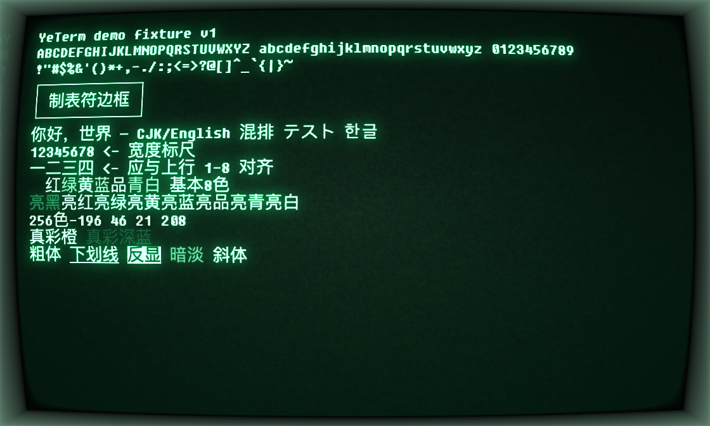
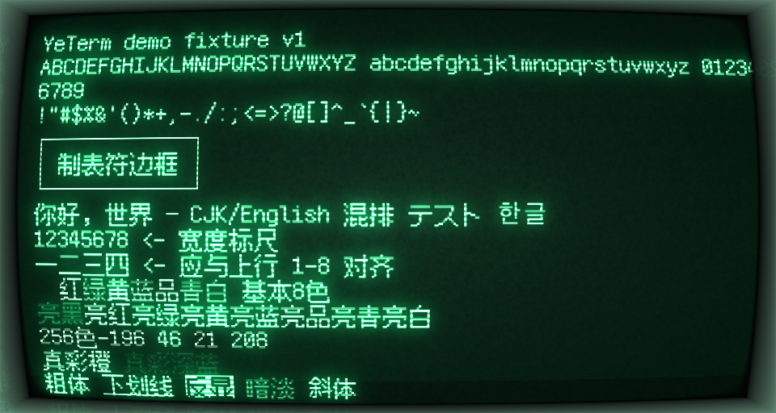
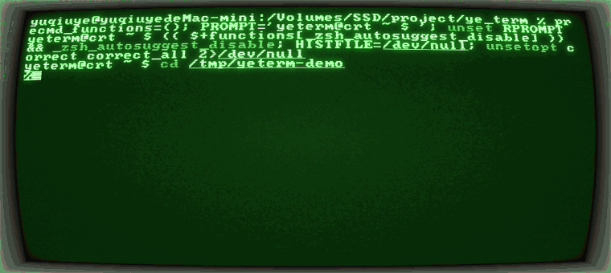
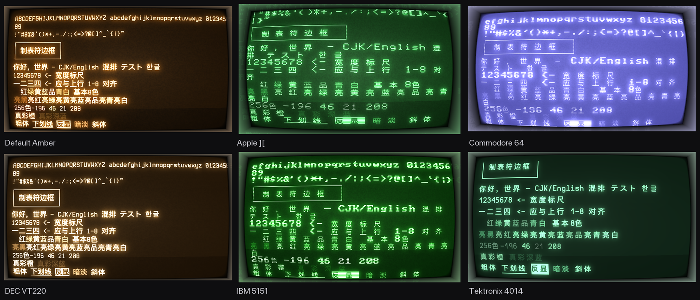
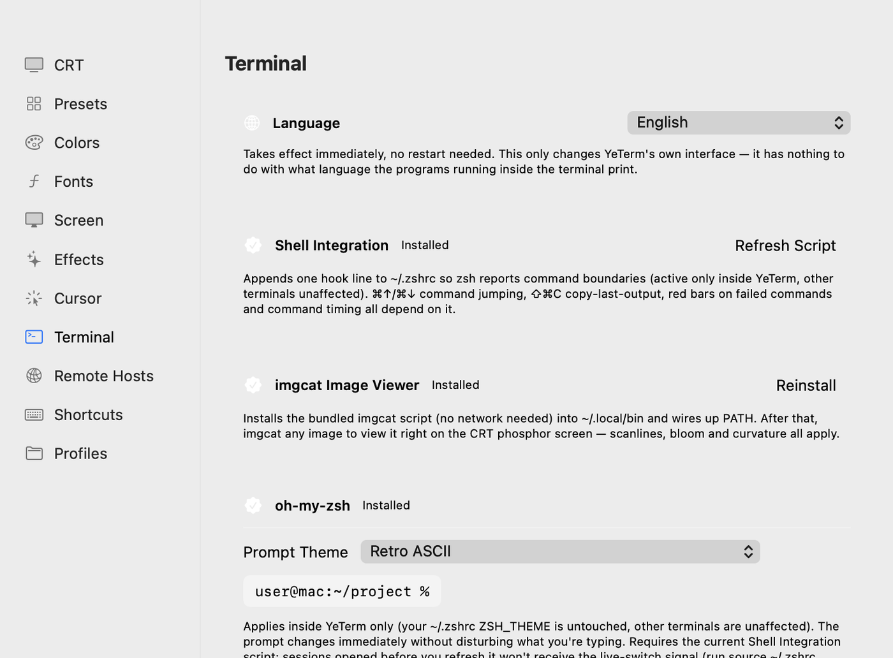

<div align="center">

# YeTerm

**一个原生 Apple Silicon 的 macOS 终端，长得像显像管，而且能在上面打中文。**

[](https://github.com/qiuye97/YeTerm/actions/workflows/ci.yml)
[](LICENSE)


[English](README.md) · [更新日志](CHANGELOG.md) · [参与开发](CONTRIBUTING.md)



</div>

---

## 为什么会有这个项目

我每天都在用 [**cool-retro-term**](https://github.com/Swordfish90/cool-retro-term)，很喜欢它。后来有两件事让我决定自己写一个：

**1. Rosetta 要没了。** cool-retro-term 是 x86_64 的包，在 Apple Silicon 上靠 Rosetta 2 翻译运行。苹果一直在收缩 Rosetta。等它真的退场，那个二进制就跑不起来了——我用惯的终端也就跟着没了。YeTerm 是 **arm64 原生**，不经翻译层。

**2. 它上面打不了中文。** 这条才是真正难受的。在 cool-retro-term 里，只要打开扫描线或者像素网格，字体选择就被锁死在几款内置的西文点阵字体上；选任何中文字体，特效直接拒绝生效。于是你只能二选一：要复古观感，还是要中文。

这个限制不是它故意为难人——它的光栅化依赖每款字体预置的像素度量（`pixelSize` / `fontWidth` / `lineSpacing`），而这些元数据只有内置字体才有。YeTerm 走的是另一条路：**所有 CRT 特效都是作用在「已渲染好的文字纹理」上的全屏后处理，与字体完全解耦。** 文字先用你选的任意字体正常栅格化，特效再叠加到纹理上；像素网格的间距从当前字体的实际字符格尺寸推导，而不是查表。

所以下面这件事成立了，而这就是整个项目的意义：

<div align="center">

<br><em>方舟像素（中文点阵字体）叠加扫描线 + 磷光染色 + 屏幕弧度。全角字符的列对齐依然正确。</em>
</div>

顺手还修了第三个别扭之处：cool-retro-term 只能开**一个窗口**。YeTerm 有原生多窗口、标签页和分屏。

## 长什么样

<div align="center">

<br><em>特效是活的——闪烁、雪花、移动亮线、磷光余辉。</em>
</div>

**43 套内置预设。** 21 套还原具体机型，22 套是经典配色方案（Solarized、Dracula、Nord、Gruvbox、Tokyo Night、Catppuccin…）。

<div align="center">

</div>

每套机型预设都按那台机器**真实的物理特性**调过——Tektronix 4014 是**存储管**，图像画上去就存在荧光屏上、不需要刷新，所以它的余辉拉到最满；IBM 5151 用的是 P39 长余辉磷光，所以移动的字会拖出绿色尾巴；Commodore 64 那个蓝底淡紫字来自 VIC-II 显示芯片。

## 功能

- **CRT 渲染** —— 扫描线 / 像素网格 / 子像素光栅化、屏幕弧度、辉光、磷光余辉、雪花噪点、画面闪烁、水平失步、RGB 色差、抖动、移动亮线、带环境光反射的机壳边框
- **「文字发光」拆成两半** ——「笔画自身发白」（白热化，零半径）和「照亮周围」（辉光）在物理上是两件不相干的事，所以做成两个独立旋钮。参数以真 VT220 的照片为靶定标。
- **普通模式** —— 一个 ⌘E 全部关掉，就是干净的现代终端，且拥有一套独立的配色系统
- **任意等宽字体、任意文字系统** —— 包括中日韩，在所有光栅化模式下都成立
- **多窗口 / 标签页 / 分屏**，带荧光分割线
- **波特率限速** —— 15 档，从 110 bps 起。想看文字一行行爬上屏幕的话
- **终端内显示图片**（iTerm2 + Kitty 协议）—— 图片会过完整条 CRT 管线
- **命令导航**（OSC 133）、搜索、⌘点击链接与文件路径、粘贴保护、会话恢复、截图与 GIF 导出
- **SSH 主机清单** —— 密码只进系统钥匙串，对老设备自动降级算法重连
- **双语界面** —— English / 简体中文，切换即时生效不用重启
- **提示符主题** —— 四套零依赖的复古提示符 + 精选 oh-my-zsh 主题，热切换

## 性能

复古观感不该以牺牲可用性为代价。用终端无关的跑分器实测（`scripts/bench.sh`——往 stdout 写一坨负载，计时终端把 PTY 抽干需要多久，和 vtebench 同一套思路）：

| 场景 | Ghostty | Terminal.app | **YeTerm**（开 CRT） | cool-retro-term |
|---|---|---|---|---|
| 纯文本滚动 | 0.083s | 0.154s | **0.072s** | 0.283s |
| 密集 ANSI 颜色 | **0.077s** | 0.296s | 0.158s | 0.441s |
| 中文宽字符 | **0.061s** | 0.174s | 0.082s | 0.352s |
| 整屏重绘 | 0.065s | 0.120s | **0.045s** | 0.201s |
| 光标随机跳转 | **0.024s** | 0.079s | 0.051s | 0.050s |
| **合计** | **0.311s** | 0.823s | 0.408s | 1.328s |
| **相对** | **1.00×** | 2.65× | 1.31× | 4.27× |

*100×30 格，跑 3 次取中位数。Ghostty 比我们快，这一点没什么好回避的——那是一个认真做性能的终端。我在意的数字是：YeTerm 比 cool-retro-term **快 3.3×**、比 Terminal.app **快 2×**，中文场景领先幅度更大。*

有两条结论值得单独说：

- **开不开 CRT 特效，吞吐几乎不变**（关 0.405s / 开 0.408s）。瓶颈在 VT 解析，不在着色器——这恰好是「特效做成解耦的后处理」这条路线的最好论据。
- **中文解析必须打补丁。** 上游 SwiftTerm 的多字节热路径**每个字符**都要付一次堆分配、一次 UTF-8 解码、多次 ICU 属性查询，导致中文比 ASCII 慢 20.6 倍。YeTerm 用的是加了快路径的 [fork](https://github.com/qiuye97/SwiftTerm)，压到 3.4 倍（`--perf-probe` 可复现）。

## 安装

**需要 macOS 15 以上，Apple Silicon 机型。**

### 下载现成的包

从 [Releases](https://github.com/qiuye97/YeTerm/releases) 下载 `.zip`，解压后把 `YeTerm.app` 拖进「应用程序」。

> ### ⚠️ 第一次打开会被系统拦住
>
> 你会看到「**Apple 无法验证"YeTerm"是否包含恶意软件**」。**这是预期内的，不代表你下载的东西有问题。**
>
> 这个 app **是签了名的**，只是签的是 ad-hoc 签名，不是 Apple Developer ID，也没有经过公证。这两样都需要 Apple 开发者计划（$99/年）的会员资格，本项目没有。macOS 对所有没有这个的 app 一视同仁。
>
> 两种放行方式：
>
> **走界面** —— 先双击一次让它失败，然后打开 **系统设置 → 隐私与安全性**，拉到最底下，在关于 YeTerm 的那条提示旁点「**仍要打开**」，再打开一次 app 并确认。（较新的 macOS 已经取消了「右键→打开」这条老捷径，所以这是真正管用的路径。）
>
> **或者用终端** —— 直接去掉下载隔离标记：
> ```bash
> xattr -dr com.apple.quarantine /Applications/YeTerm.app
> ```
>
> 这一步只需要做一次。
>
> 如果你不放心，也完全可以跳过下载、直接从源码构建（见下），那样不会有任何提示。

想核对下载是否完整的话，每个 Release 都附了 SHA-256：

```bash
shasum -a 256 YeTerm-1.1.0.zip
```

### 或者自己从源码构建

这条路不会有 Gatekeeper 提示，因为是你本机编出来的。

```bash
git clone https://github.com/qiuye97/YeTerm.git
cd YeTerm
swift build -c release
swift run -c release YeTerm
```

打成 `.app`：

```bash
bash scripts/make_app.sh      # 产物在 dist/YeTerm.app
open dist/YeTerm.app
```

<details>
<summary><strong>构建说明</strong></summary>

- 用 macOS 26 SDK 编译，但部署目标是 macOS 15。SwiftPM 会把部署目标**同时**写进 `LC_BUILD_VERSION` 的 `minos` 和 `sdk` 两个字段，而 macOS 26 是靠「链接的 SDK ≥ 26」来决定要不要给这个 app 上 Liquid Glass 外观——所以 `make_app.sh` 里跑了一次 `vtool -set-build-version macos 15.0 26.0` 把两个字段分开设。因此需要一个带 macOS 26 SDK 的 Xcode。
- Metal 着色器是运行时从 `.metal` 源码编译的（`--shader-dir` 可重定向到文件系统方便边改边看，⌘R 热重载）。
- `bash scripts/verify_m0.sh` 跑全量回归，末行输出 `M0-GREEN` 为通过。

</details>

## 配置

设置存在 `~/Library/Application Support/YeTerm/config.json`，格式兼容 cool-retro-term 导出的配置。主题是 `profiles/` 目录下一个个独立的 JSON 文件。

每个字段都写在[主题配置格式文档](Sources/YeTermKit/Resources/Docs/主题配置格式.md)里，这份文档也打包进了 app——设置 → 配置文件 → 「保存到电脑」。它是照着「可以直接丢给 AI 让它帮你生成主题」的思路写的。

<div align="center">

</div>

## 这个项目是怎么做出来的

**这个项目的每一行代码都是 [Claude Code](https://claude.com/claude-code) 写的。** 我是做 Java / Web 的，不会 Swift、不会 Metal、不懂 AppKit。我扮演的是产品负责人：决定做什么、每一版亲手试、说「这个观感还不对」、在需要取舍的时候拍板。工程实现全部由 Claude 完成。

8 天：51 个文件、15,448 行 Swift，外加 1,078 行 Metal 着色器。

我把这件事写出来，一半是因为该讲实话，一半是因为我觉得有意思的地方不在「AI 写的」，而在**这件事到底需要什么**。真正让它成立的，恰恰是那些不性感的部分：

- **一切都要回源码核对。** CRT 特效是从 cool-retro-term 的 GLSL 移植过来的，每一个常数都对着归档的原版逐条核过——过程中发现我一开始的几条假设是错的，比如 `contrast` 和 `saturation` 根本进不了着色器，它们是在 CPU 侧先把颜色预混好的。
- **要实测，不要推演。** 有三次我们实现了「物理上更正确」的发光模型，三次都被一张真显像管的照片推翻。真磷光的亮部**确实**会往白里褪；那个看起来显然正确的「能量守恒」模型，出来的画面就是不对。每一次都是实测赢。
- **自测体系必须先建起来。** 有一个离屏渲染 harness 做逐像素比对，一个探针会实例化设置窗并逐页截图，还有一个驱动器合成真实键盘事件跑完 28 个场景 75 个步骤。没有这些，一个这种体量的 AI 写的代码库几天就烂掉了。

## 致谢

**[cool-retro-term](https://github.com/Swordfish90/cool-retro-term)**（Filippo Scognamiglio 及贡献者）—— 观感标杆，也是源材料。这里的着色器就是从它的 GLSL 移植的，YeTerm 因此是 GPL-3。这个项目不是要取代它，而是想在它跑不动的硬件上把那份味道留住，顺带修掉上面说的三条限制。

**[SwiftTerm](https://github.com/migueldeicaza/SwiftTerm)**（Miguel de Icaza）—— 终端仿真内核。从零写一个 VT100/xterm 解析器，这个项目大概率就死在那儿了。

**[Cathode](https://secretgeometry.com/apps/cathode/)**（Secret Geometry 出品）—— 一款做得非常漂亮的商业复古终端。是它让我意识到「笔画自身发白」和「光晕照亮周围」是两件不相干的事、应该分开调，YeTerm 的白热化参数正是循着这个想法做出来的。向它的作者致敬。

**字体** —— 方舟像素、Terminus、Inconsolata、Hermit、Fixedsys Excelsior、ProggyTiny、ProFont、PxPlus IBM（VileR / int10h）、Pet Me 与 Print Char 21（Kreative Software）、Atari Classic（Mark Simonson）、C64 Pro Mono（Style）。全部许可原文见 [THIRD-PARTY-NOTICES.md](THIRD-PARTY-NOTICES.md)，也随 app 一起分发。

## 一点说明：这是我第一次开源

这东西是我给自己做的，拿出来是觉得可能对别人也有点用。我不是 Swift 开发者，里面肯定有会让资深 macOS 工程师皱眉的代码。**还请各位手下留情**——当然，如果你发现了真正的问题，一个讲清楚**为什么错**的 issue，对我来说比礼貌的沉默有价值得多。

**关于许可与署名：** 我尽力想把这件事做对——每一款内置字体的许可都逐个对照上游条款核实过，其中一款因为许可不允许再分发，在开源前已经移除；着色器的来源也逐文件写清楚了。但我在这方面是外行，可能仍有疏漏。

**如果这个项目侵犯了你的作品——代码、字体、商标，任何东西——请开一个 issue 或者给我发邮件。我会下架。不争辩，不拖延。** 与其留着一个本不该由我发布的东西，我宁可不要这个项目。

## 许可

Copyright © 2026 [qiuye97](https://github.com/qiuye97)。

**GPL-3.0-or-later**，见 [LICENSE](LICENSE)。

CRT 着色器派生自 cool-retro-term 的 GPL-3 GLSL，所以这个许可是继承来的，不是选来的。第三方组件与各自的许可逐项列在 [THIRD-PARTY-NOTICES.md](THIRD-PARTY-NOTICES.md)。
